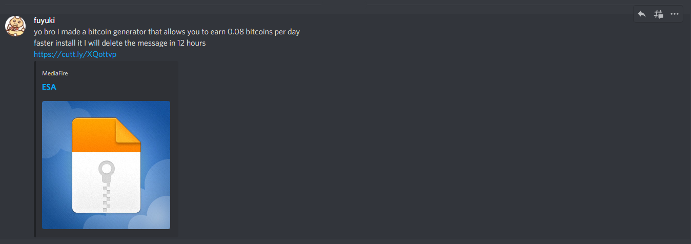

# Redline Server Spammer
Spamming randomized nonsense data against Redline stealers' C&amp;C servers.  

## Brief intro
Screenshot of a malicious Discord spam message posted by a compromised account:  
  

The posted link leads to a Mediafire link that is now offline  
hxxps://www.mediafire[.]com/file/5cv89nrmer0yb7k/ESA.rar/file  

VirusTotal scan of the executable in the downloaded archive:  
https://www.virustotal.com/gui/file/ed834c43c24a468fbbdf46fef36c44e0979d996b8ce1d6c16f4f39323151519d/detection
  
Virustotal scan of the decrypted payload:  
https://www.virustotal.com/gui/file/f42e3406469f45d2b4b87f90a2b584f12018ba8e1fd29f7518748e901b5ddda9/detection
  
## WARNING(1): Do NOT use/modify this tool against innocent websites.
I uploaded the script just for ppls to spam malicious sites only, in effort of taking those scumbags down or at least rendering their service unavailable.
  
## WARNING(2): Source code contains offensive words and phrases.
The random messages pool contains extremely offensive and rude words. I am NOT endorsing ANY kind of behaviors described in those insulting sentences. Those are just used to make the perpetrators extra mad.  
  
## Usage
`node /path/to/directory/of/package`  
  
You should run this script ONLY under sandboxed environments with proper VPN settings. Node.js >= 11.7.0 is required.
